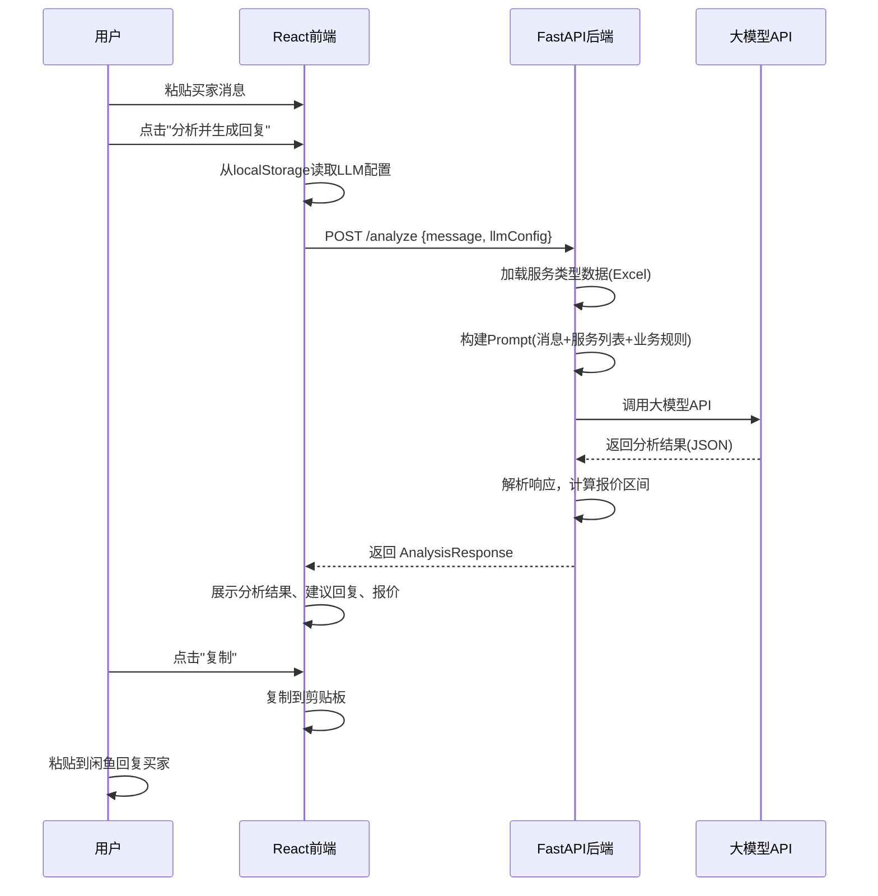

# 闲鱼代写助手 - 产品需求文档 (PRD)

> 版本：V2.0
> 创建日期：2025-12-29
> 更新日期：2025-12-30
> 状态：V2 已完成

---

## 一、核心目标 (Mission)

**让闲鱼代写卖家能够专业、高效地回复买家咨询，通过智能需求挖掘提升成交率。**

---

## 二、用户画像 (Persona)

| 属性 | 描述 |
|------|------|
| **身份** | 闲鱼平台文章代写服务卖家 |
| **核心痛点** | 面对多样化的代写需求时，不知如何专业回复，容易丢失客户 |
| **期望** | 快速生成专业回复，自动挖掘遗漏需求，给出合理报价范围 |
| **使用场景** | 收到买家咨询后，复制消息到工具，获取专业回复建议 |

---

## 三、版本规划

### V1: 最小可行产品 (MVP) - 已完成

| 模块 | 功能描述 | 状态 |
|------|----------|------|
| **1. 大模型配置** | 支持自定义配置：Base URL、API Key、模型ID；配置持久化存储到本地 | ✅ |
| **2. 消息输入** | 文本框支持粘贴买家消息，一键清空 | ✅ |
| **3. 智能分析** | 识别文章类型（24种）、提取已知信息、识别缺失信息 | ✅ |
| **4. 回复生成** | 生成亲切友好专业的话术，自动追问遗漏需求，支持一键复制 | ✅ |
| **5. 智能报价** | 根据类型/字数/复杂度/紧急程度给出价格区间及计算依据 | ✅ |
| **6. 服务速查** | 展示24种服务类型及价格，支持搜索筛选 | ✅ |
| **7. 提示词配置** | 支持在前端编辑分析提示词和系统提示词 | ✅ |

### V2: 历史记录与模板库 - 已完成

| 模块 | 功能描述 | 状态 |
|------|----------|------|
| **1. 历史记录** | 自动保存每次分析记录，支持查看详情 | ✅ |
| **2. 标签页切换** | 顶部标签页切换"消息分析"和"历史记录" | ✅ |
| **3. 成交标记** | 可标记每条记录的成交状态（待定/已成交/未成交） | ✅ |
| **4. 文章类型标记** | 可标记实际文章类型，支持自定义类型 | ✅ |
| **5. 搜索筛选** | 支持按消息内容搜索、按类型和状态筛选 | ✅ |
| **6. 回复模板库** | 预设8个常用话术模板，支持增删改 | ✅ |
| **7. 模板插入** | 可将模板一键插入到生成的回复中 | ✅ |
| **8. 回复编辑** | 支持手动编辑生成的回复内容 | ✅ |

### V3 及以后版本 (Future Releases)

| 版本 | 功能 | 描述 |
|------|------|------|
| V3 | 成交统计分析 | 各类型成交率统计，发现高价值服务 |
| V3 | 数据导出 | 历史记录导出为Excel |
| V3 | 客户管理 | 回头客信息和偏好记录 |
| V4 | 订单跟踪 | 进行中订单状态管理 |
| V4 | 多端同步 | 数据云端同步 |

---

## 四、关键业务逻辑 (Business Rules)

### 4.1 服务类型与定价（24种）

| 序号 | 服务类型 | 简单(元/千字) | 复杂(元/千字) | 备注 |
|------|----------|---------------|---------------|------|
| 1 | 演讲稿 | 40 | 80 | |
| 2 | 新闻稿、报道稿 | 80 | 160 | 需要看材料 |
| 3 | 实习/调查报告（含问卷数据分析） | 60 | 80 | |
| 4 | 实习/调查报告（不含问卷） | 40 | 60 | |
| 5 | 公众号文章、小红书文案 | 50 | 80 | |
| 6 | 润色简历 | 50 | 80 | |
| 7 | 公文体写作 | 100 | 300 | |
| 8 | 公文体写作（需看材料） | 300 | 500 | |
| 9 | 策划案 | 200 | 800 | 按篇计价 |
| 10 | 商业计划书（商用） | 200 | 800 | |
| 11 | 商业计划书（作业） | 50 | 80 | |
| 12 | 课题申报书、高校申报 | 300 | 800 | |
| 13 | 征文 | 40 | 100 | |
| 14 | 留学文书 | - | 500 | |
| 15 | 工作周报月报 | 30 | 50 | |
| 16 | 英文报告 | 80 | 100 | |
| 17 | 诗歌/散文/检讨/信件/翻译/情书/文案 | 40 | 60 | |
| 18 | 手写 | 20 | - | |
| 19 | PPT | 5 | 10 | 按页计价 |
| 20 | 数据分析/股票投资分析报告 | 120 | 240 | |
| 21 | 教案和课题设计 | 80 | 240 | |
| 22 | 剧本/直播稿 | 90 | 180 | |
| 23 | 文献综述 | 80 | 120 | |
| 24 | 看视频写文案 | 10 | 25 | 按分钟计价 |

**最低限制：所有类型报价不低于千字20元**

### 4.2 报价计算规则

```
报价区间 = 基础单价(千字) × 字数 ÷ 1000 × 复杂度系数 × 紧急系数

复杂度系数：
  - 简单要求：1.0
  - 复杂要求：1.5 - 2.0

紧急系数：
  - 正常（3天以上）：1.0
  - 加急（1-3天）：1.3
  - 特急（24小时内）：1.5 - 2.0
```

### 4.3 必须挖掘的需求清单

| 需求项 | 适用类型 | 追问话术示例 |
|--------|----------|--------------|
| 字数要求 | 全部 | "请问您对字数有具体要求吗？" |
| 交付时间 | 全部 | "您希望什么时候交稿呢？" |
| 参考材料 | 新闻稿、公文、调查报告等 | "您这边有相关材料可以提供吗？" |
| 格式要求 | 论文、公文、申报书 | "对格式有特殊要求吗？比如字体、行距等" |
| 查重要求 | 学术类 | "需要查重吗？查重率要求多少？" |
| 数据分析 | 调查报告 | "需要包含问卷设计和数据分析吗？" |

---

## 五、数据契约 (Data Contract)

### 5.1 大模型配置

```typescript
interface LLMConfig {
  baseUrl: string;    // API 地址，如 https://api.openai.com/v1
  apiKey: string;     // API 密钥
  modelId: string;    // 模型 ID，如 gpt-4, claude-3-opus
}
```

### 5.2 服务类型数据

```typescript
interface ServiceType {
  id: number;                    // 服务ID
  name: string;                  // 服务名称
  priceSimple: number | null;    // 简单要求价格
  priceComplex: number | null;   // 复杂要求价格
  unit: 'thousand' | 'page' | 'minute' | 'piece';  // 计价单位
  requiresMaterial: boolean;     // 是否需要材料
  keywords: string[];            // 识别关键词
}
```

### 5.3 分析请求/响应

```typescript
// 请求
interface AnalysisRequest {
  message: string;               // 买家原始消息
}

// 响应
interface AnalysisResponse {
  // 识别结果
  detectedType: ServiceType | null;    // 识别的文章类型
  possibleTypes: ServiceType[];        // 可能的类型列表
  confidence: number;                  // 置信度 0-1

  // 已提取信息
  extractedInfo: {
    topic?: string;                    // 主题/题目
    wordCount?: number;                // 字数要求
    deadline?: string;                 // 截止日期
    hasReference?: boolean;            // 是否有参考材料
    specialRequirements?: string[];    // 特殊要求
  };

  // 缺失信息
  missingInfo: string[];               // 需要追问的信息列表

  // 生成的回复
  suggestedReply: string;              // 建议的回复话术

  // 报价信息
  priceEstimate: {
    min: number;                       // 最低报价
    max: number;                       // 最高报价
    basis: string;                     // 报价依据说明
    canQuote: boolean;                 // 信息是否足够报价
  };
}
```

---

## 六、MVP 原型设计

### 选定方案：原型A - 单页纵向流式布局

**设计理念：** 从上到下的操作流程，简洁直观，适合快速操作

```
┌─────────────────────────────────────────────────────────────────┐
│  ⚙️ 闲鱼代写助手                                    [设置]      │
├─────────────────────────────────────────────────────────────────┤
│                                                                 │
│  ┌─────────────────────────────────────────────────────────┐   │
│  │  📝 粘贴买家消息                                        │   │
│  │                                                         │   │
│  │  您好，我想写一篇关于人工智能的论文，大概5000字，       │   │
│  │  下周三之前要...                                        │   │
│  │                                                         │   │
│  │                                                         │   │
│  └─────────────────────────────────────────────────────────┘   │
│                                                                 │
│                    [ 🔍 分析并生成回复 ]                        │
│                                                                 │
├─────────────────────────────────────────────────────────────────┤
│  📊 分析结果                                                    │
│  ┌──────────────────┐ ┌──────────────────┐ ┌─────────────────┐ │
│  │ 类型: 文献综述   │ │ 字数: 5000字     │ │ 截止: 下周三    │ │
│  └──────────────────┘ └──────────────────┘ └─────────────────┘ │
│                                                                 │
│  ⚠️ 缺失信息: 查重要求 | 格式要求 | 参考文献数量                │
├─────────────────────────────────────────────────────────────────┤
│  💬 建议回复                                          [复制]    │
│  ┌─────────────────────────────────────────────────────────┐   │
│  │ 您好呀～感谢咨询！人工智能论文5000字下周三交付完全      │   │
│  │ 没问题的～为了给您更好的服务，想再确认几个小细节：      │   │
│  │ 1. 请问对查重率有要求吗？                               │   │
│  │ 2. 格式方面有特殊要求吗（字体、行距、参考文献格式）？   │   │
│  │ 3. 需要包含多少篇参考文献呢？                           │   │
│  └─────────────────────────────────────────────────────────┘   │
├─────────────────────────────────────────────────────────────────┤
│  💰 报价参考                                                    │
│  ┌─────────────────────────────────────────────────────────┐   │
│  │  预估价格: ¥400 - ¥600                                  │   │
│  │  计算依据: 文献综述 80-120元/千字 × 5千字               │   │
│  │  ⚠️ 最终报价需确认查重、格式等具体要求后确定            │   │
│  └─────────────────────────────────────────────────────────┘   │
│                                                                 │
│  📋 [查看完整价目表]                                            │
└─────────────────────────────────────────────────────────────────┘
```

### 设置弹窗

```
┌─────────────────────────────────────────────┐
│  ⚙️ 大模型配置                         [×]  │
├─────────────────────────────────────────────┤
│                                             │
│  API 地址 (Base URL)                        │
│  ┌───────────────────────────────────────┐ │
│  │ https://api.openai.com/v1             │ │
│  └───────────────────────────────────────┘ │
│                                             │
│  API 密钥 (API Key)                         │
│  ┌───────────────────────────────────────┐ │
│  │ sk-xxxx••••••••••••                   │ │
│  └───────────────────────────────────────┘ │
│                                             │
│  模型 ID                                    │
│  ┌───────────────────────────────────────┐ │
│  │ gpt-4                                 │ │
│  └───────────────────────────────────────┘ │
│                                             │
│           [ 测试连接 ]  [ 保存配置 ]        │
│                                             │
└─────────────────────────────────────────────┘
```

### 价目表弹窗

```
┌────────────────────────────────────────────────────────────┐
│  📋 服务价目表                                        [×]  │
├────────────────────────────────────────────────────────────┤
│  🔍 搜索服务类型...                                        │
├────────────────────────────────────────────────────────────┤
│  服务类型                    │ 简单(千字) │ 复杂(千字)     │
│  ─────────────────────────────────────────────────────────│
│  演讲稿                      │    ¥40    │    ¥80        │
│  新闻稿、报道稿(需看材料)    │    ¥80    │    ¥160       │
│  公众号文章、小红书文案      │    ¥50    │    ¥80        │
│  文献综述                    │    ¥80    │    ¥120       │
│  ...                         │    ...    │    ...        │
├────────────────────────────────────────────────────────────┤
│  💡 所有类型最低报价：千字20元                             │
└────────────────────────────────────────────────────────────┘
```

---

## 七、架构设计蓝图

### 7.1 系统架构图

```
┌─────────────────────────────────────────────────────────────────┐
│                         用户浏览器                              │
│  ┌───────────────────────────────────────────────────────────┐ │
│  │                    React 前端应用                         │ │
│  │  ┌─────────┐ ┌─────────┐ ┌─────────┐ ┌─────────────────┐ │ │
│  │  │消息输入 │ │分析结果 │ │回复展示 │ │ 设置/价目表弹窗 │ │ │
│  │  └─────────┘ └─────────┘ └─────────┘ └─────────────────┘ │ │
│  │                         │                                 │ │
│  │              localStorage (配置存储)                      │ │
│  └───────────────────────────────────────────────────────────┘ │
└─────────────────────────────────────────────────────────────────┘
                              │ HTTP API
                              ▼
┌─────────────────────────────────────────────────────────────────┐
│                      FastAPI 后端服务                           │
│  ┌─────────────┐ ┌─────────────┐ ┌─────────────────────────┐   │
│  │  /analyze   │ │  /services  │ │  /config (可选)         │   │
│  │  消息分析   │ │  服务列表   │ │  配置管理               │   │
│  └─────────────┘ └─────────────┘ └─────────────────────────┘   │
│         │                                                       │
│  ┌──────┴──────────────────────────────────────────────────┐   │
│  │                    核心服务层                            │   │
│  │  ┌────────────┐ ┌────────────┐ ┌────────────────────┐   │   │
│  │  │ LLM 服务   │ │ 报价计算   │ │ 服务类型匹配       │   │   │
│  │  └────────────┘ └────────────┘ └────────────────────┘   │   │
│  └─────────────────────────────────────────────────────────┘   │
│         │                                                       │
│  ┌──────┴──────────────────────────────────────────────────┐   │
│  │                    数据层                                │   │
│  │  ┌────────────────────┐ ┌────────────────────────────┐  │   │
│  │  │ 报价参考.xlsx      │ │ Prompt 模板                │  │   │
│  │  │ (服务类型/价格)    │ │ (回复生成模板)             │  │   │
│  │  └────────────────────┘ └────────────────────────────┘  │   │
│  └─────────────────────────────────────────────────────────┘   │
└─────────────────────────────────────────────────────────────────┘
                              │
                              ▼
┌─────────────────────────────────────────────────────────────────┐
│                      外部大模型 API                             │
│              (OpenAI / Claude / 其他兼容API)                    │
└─────────────────────────────────────────────────────────────────┘
```

### 7.2 核心流程图



### 7.3 目录结构

```
xianyu_answer/
├── frontend/                    # React 前端
│   ├── src/
│   │   ├── components/          # UI 组件
│   │   │   ├── MessageInput.tsx     # 消息输入框
│   │   │   ├── AnalysisResult.tsx   # 分析结果展示
│   │   │   ├── ReplySection.tsx     # 建议回复区
│   │   │   ├── PriceEstimate.tsx    # 报价展示
│   │   │   ├── SettingsModal.tsx    # 设置弹窗
│   │   │   └── PriceListModal.tsx   # 价目表弹窗
│   │   ├── hooks/
│   │   │   └── useLocalStorage.ts   # 本地存储Hook
│   │   ├── services/
│   │   │   └── api.ts               # API 调用
│   │   ├── types/
│   │   │   └── index.ts             # TypeScript 类型定义
│   │   ├── App.tsx
│   │   └── main.tsx
│   ├── package.json
│   └── vite.config.ts
│
├── backend/                     # Python 后端
│   ├── app/
│   │   ├── main.py                  # FastAPI 入口
│   │   ├── routers/
│   │   │   ├── analyze.py           # /analyze 路由
│   │   │   └── services.py          # /services 路由
│   │   ├── services/
│   │   │   ├── llm_service.py       # 大模型调用服务
│   │   │   ├── price_service.py     # 报价计算服务
│   │   │   └── type_matcher.py      # 类型匹配服务
│   │   ├── models/
│   │   │   └── schemas.py           # Pydantic 模型
│   │   ├── prompts/
│   │   │   └── analyze_prompt.py    # Prompt 模板
│   │   └── data/
│   │       └── services_loader.py   # Excel 数据加载
│   ├── requirements.txt
│   └── run.py
│
├── 报价参考.xlsx                # 服务类型与价格数据
├── CLAUDE.md                    # 开发指南
├── Prd.md                       # 本文档
└── README.md
```

### 7.4 组件交互说明

#### 前端组件

| 组件 | 职责 | 交互 |
|------|------|------|
| `App.tsx` | 主容器，状态管理 | 管理全局状态，协调子组件 |
| `MessageInput` | 消息输入 | 向上传递消息内容 |
| `AnalysisResult` | 分析结果展示 | 接收并展示分析数据 |
| `ReplySection` | 回复展示+复制 | 接收回复内容，处理复制 |
| `PriceEstimate` | 报价展示 | 接收报价数据 |
| `SettingsModal` | LLM配置 | 读写 localStorage |
| `PriceListModal` | 价目表 | 调用 /services API |

#### 后端模块

| 模块 | 职责 | 依赖 |
|------|------|------|
| `main.py` | FastAPI 应用入口 | routers/* |
| `analyze.py` | 分析接口 | llm_service, price_service |
| `llm_service.py` | 大模型调用封装 | httpx/aiohttp |
| `price_service.py` | 报价计算 | services_loader |
| `services_loader.py` | 加载Excel数据 | pandas, openpyxl |

### 7.5 技术选型

| 层级 | 技术 | 版本 | 选型理由 |
|------|------|------|----------|
| **前端框架** | React | 18.x | 用户指定，生态成熟 |
| **前端构建** | Vite | 5.x | 快速开发，HMR支持 |
| **前端样式** | Tailwind CSS | 3.x | 快速开发，响应式 |
| **前端语言** | TypeScript | 5.x | 类型安全 |
| **后端框架** | FastAPI | 0.100+ | 异步高性能，自动文档 |
| **Python版本** | 3.11 | - | conda环境已配置 |
| **数据处理** | pandas | 2.x | Excel读取 |
| **HTTP客户端** | httpx | 0.25+ | 异步请求大模型API |
| **部署** | 宝塔面板 | - | 用户已有环境 |

### 7.6 潜在技术风险

| 风险 | 影响 | 缓解措施 |
|------|------|----------|
| **大模型API不稳定** | 请求超时或失败 | 设置超时时间，友好错误提示，支持重试 |
| **大模型返回格式不一致** | 解析失败 | 使用结构化输出(JSON mode)，增加容错处理 |
| **API Key泄露** | 安全风险 | 前端不直接调用大模型，Key仅存后端或用户本地 |
| **Excel数据变更** | 价格不同步 | 提供数据刷新机制，或改用数据库(V2) |
| **跨域问题** | 前后端通信失败 | 开发时配置代理，生产时同源部署 |

---

## 八、部署方案

### 8.1 部署架构

```
用户手机/电脑浏览器
        │
        ▼
┌─────────────────┐
│  xianyu.wyqaii.top  │  (子域名，阿里云DNS解析)
└─────────────────┘
        │
        ▼
┌─────────────────────────────────────┐
│  腾讯云轻量服务器                    │
│  111.231.107.149                    │
│  OpenCloudOS 9 + 宝塔面板           │
│                                     │
│  ┌─────────────────────────────┐   │
│  │  Nginx (反向代理 + 静态文件) │   │
│  │  - 静态文件: React打包产物   │   │
│  │  - 代理: /api/* → FastAPI   │   │
│  └─────────────────────────────┘   │
│              │                      │
│              ▼                      │
│  ┌─────────────────────────────┐   │
│  │  FastAPI (Python项目管理器)  │   │
│  │  端口: 8000                  │   │
│  └─────────────────────────────┘   │
└─────────────────────────────────────┘
```

### 8.2 部署步骤概要

1. **DNS配置**：阿里云添加A记录 `xianyu` → `111.231.107.149`
2. **前端打包**：`npm run build` 生成静态文件
3. **后端部署**：宝塔Python项目管理器配置FastAPI
4. **Nginx配置**：静态文件 + API反向代理
5. **SSL证书**：宝塔一键申请Let's Encrypt

---

## 九、验收标准

### V1 MVP 完成标准 - 已通过

- [x] 可配置大模型API（Base URL / API Key / 模型ID）
- [x] 可粘贴买家消息并分析
- [x] 正确识别24种服务类型
- [x] 生成亲切友好专业的回复
- [x] 自动追问缺失的关键信息
- [x] 显示报价区间及计算依据
- [x] 回复内容可一键复制
- [x] 可查看完整价目表
- [x] 提示词可自定义编辑

### V2 完成标准 - 已通过

- [x] 每次分析自动保存历史记录
- [x] 顶部标签页切换消息分析/历史记录
- [x] 历史记录支持搜索和筛选
- [x] 可标记成交状态和文章类型
- [x] 回复模板库预设常用话术
- [x] 模板支持增删改和一键插入
- [x] 生成的回复支持编辑

---

## 十、附录

### A. 阿里云DNS配置参考

| 记录类型 | 主机记录 | 记录值 |
|----------|----------|--------|
| A | xianyu | 111.231.107.149 |

### B. 开发环境

```bash
# Python 环境
/opt/miniconda3/envs/xianyu/bin/python

# Node.js 环境
export NVM_DIR="$HOME/.nvm" && [ -s "$NVM_DIR/nvm.sh" ] && \. "$NVM_DIR/nvm.sh"
nvm use 22
```

---

**文档状态：V2 已完成，待部署**
