# 闲鱼代写助手 - 产品需求文档 (PRD)

> 版本：V4.0
> 创建日期：2025-12-29
> 更新日期：2026-01-02
> 状态：V4 已完成

---

## 一、核心目标 (Mission)

**让闲鱼代写卖家能够专业、高效地回复买家咨询，通过智能需求挖掘提升成交率。**

---

## 二、用户画像 (Persona)

| 属性 | 描述 |
|------|------|
| **身份** | 闲鱼平台文章代写服务卖家 |
| **核心痛点** | 面对多样化的代写需求时，不知如何专业回复，容易丢失客户 |
| **期望** | 快速生成专业回复，自动挖掘遗漏需求，给出合理报价范围 |
| **使用场景** | 收到买家咨询后，复制消息到工具，获取专业回复建议 |

---

## 三、版本规划

### V1: 最小可行产品 (MVP) - 已完成

| 模块 | 功能描述 | 状态 |
|------|----------|------|
| **1. 大模型配置** | 支持自定义配置：Base URL、API Key、模型ID；配置持久化存储到本地 | ✅ |
| **2. 消息输入** | 文本框支持粘贴买家消息，一键清空 | ✅ |
| **3. 智能分析** | 识别文章类型（24种）、提取已知信息、识别缺失信息 | ✅ |
| **4. 回复生成** | 生成亲切友好专业的话术，自动追问遗漏需求，支持一键复制 | ✅ |
| **5. 智能报价** | 根据类型/字数/复杂度/紧急程度给出价格区间及计算依据 | ✅ |
| **6. 服务速查** | 展示24种服务类型及价格，支持搜索筛选 | ✅ |
| **7. 提示词配置** | 支持在前端编辑分析提示词和系统提示词 | ✅ |

### V2: 历史记录与模板库 - 已完成

| 模块 | 功能描述 | 状态 |
|------|----------|------|
| **1. 历史记录** | 自动保存每次分析记录，支持查看详情 | ✅ |
| **2. 标签页切换** | 顶部标签页切换"消息分析"和"历史记录" | ✅ |
| **3. 成交标记** | 可标记每条记录的成交状态（待定/已成交/未成交） | ✅ |
| **4. 文章类型标记** | 可标记实际文章类型，支持自定义类型 | ✅ |
| **5. 搜索筛选** | 支持按消息内容搜索、按类型和状态筛选 | ✅ |
| **6. 回复模板库** | 预设8个常用话术模板，支持增删改 | ✅ |
| **7. 模板插入** | 可将模板一键插入到生成的回复中 | ✅ |
| **8. 回复编辑** | 支持手动编辑生成的回复内容 | ✅ |

### V3: 对话式助手 - 已完成

| 模块 | 功能描述 | 状态 |
|------|----------|------|
| **1. 回复清单** | 返回多个可选回复（3-5个），每个有独立复制按钮 | ✅ |
| **2. 对话会话** | 引入"会话"概念，一个买家=一个会话，支持多轮对话 | ✅ |
| **3. 上下文保持** | 对话保持连续性，AI 结合历史消息给出建议 | ✅ |
| **4. 分阶段信息** | 先回复建议 → 信息足够时提示报价 → 成交或挽留 | ✅ |
| **5. 会话状态** | 会话状态管理（进行中/已结束），区分活跃和历史对话 | ✅ |
| **6. 会话结束标记** | 结束时标记：成交状态、成交价格、文章类型 | ✅ |
| **7. 需求要点提炼** | 成交时自动提炼用户需求要点（类型、字数、截止、要求等） | ✅ |
| **8. 挽留话术** | 未成交时提供可配置的挽留话术模板 | ✅ |
| **9. 快捷回复标签** | 常用快捷标签（询问字数、截止时间等），点击即插入 | ✅ |
| **10. 报价时机判断** | 检测信息是否足够，自动提示"可以报价" | ✅ |
| **11. 历史记录删除** | 每条历史记录添加删除按钮 | ✅ |
| **12. 提示词管理** | 统一管理所有提示词（快速分析、系统、对话分析、挽留话术） | ✅ |

### V4: 移动端适配 - 已完成

| 模块 | 功能描述 | 状态 |
|------|----------|------|
| **1. 响应式布局** | 桌面端侧边栏，移动端底部导航栏 | ✅ |
| **2. 对话面板适配** | 移动端上下布局，推荐回复弹窗显示 | ✅ |
| **3. 触摸优化** | 按钮尺寸、间距适配触摸操作 | ✅ |
| **4. 安全区域** | 支持 iPhone 底部安全区域 | ✅ |
| **5. 复制功能修复** | 兼容 HTTP 环境的剪贴板操作 | ✅ |
| **6. 移除冗余功能** | 移除无效的"使用"按钮和快捷标签 | ✅ |
| **7. 友好错误提示** | API 错误时显示具体原因和解决建议 | ✅ |
| **8. 分析重试功能** | 分析失败后可一键重试，无需重新输入 | ✅ |

### V5 及以后版本 (Future Releases)

| 版本 | 功能 | 描述 |
|------|------|------|
| V5 | 成交统计分析 | 各类型成交率统计，发现高价值服务 |
| V5 | 数据导出 | 历史记录导出为Excel |
| V5 | 客户管理 | 回头客信息和偏好记录 |
| V6 | 订单跟踪 | 进行中订单状态管理 |
| V6 | 多端同步 | 数据云端同步 |

---

## 四、关键业务逻辑 (Business Rules)

### 4.1 服务类型与定价（24种）

| 序号 | 服务类型 | 简单(元/千字) | 复杂(元/千字) | 备注 |
|------|----------|---------------|---------------|------|
| 1 | 演讲稿 | 40 | 80 | |
| 2 | 新闻稿、报道稿 | 80 | 160 | 需要看材料 |
| 3 | 实习/调查报告（含问卷数据分析） | 60 | 80 | |
| 4 | 实习/调查报告（不含问卷） | 40 | 60 | |
| 5 | 公众号文章、小红书文案 | 50 | 80 | |
| 6 | 润色简历 | 50 | 80 | |
| 7 | 公文体写作 | 100 | 300 | |
| 8 | 公文体写作（需看材料） | 300 | 500 | |
| 9 | 策划案 | 200 | 800 | 按篇计价 |
| 10 | 商业计划书（商用） | 200 | 800 | |
| 11 | 商业计划书（作业） | 50 | 80 | |
| 12 | 课题申报书、高校申报 | 300 | 800 | |
| 13 | 征文 | 40 | 100 | |
| 14 | 留学文书 | - | 500 | |
| 15 | 工作周报月报 | 30 | 50 | |
| 16 | 英文报告 | 80 | 100 | |
| 17 | 诗歌/散文/检讨/信件/翻译/情书/文案 | 40 | 60 | |
| 18 | 手写 | 20 | - | |
| 19 | PPT | 5 | 10 | 按页计价 |
| 20 | 数据分析/股票投资分析报告 | 120 | 240 | |
| 21 | 教案和课题设计 | 80 | 240 | |
| 22 | 剧本/直播稿 | 90 | 180 | |
| 23 | 文献综述 | 80 | 120 | |
| 24 | 看视频写文案 | 10 | 25 | 按分钟计价 |

**最低限制：所有类型报价不低于千字20元**

### 4.2 报价计算规则

```
报价区间 = 基础单价(千字) × 字数 ÷ 1000 × 复杂度系数 × 紧急系数

复杂度系数：
  - 简单要求：1.0
  - 复杂要求：1.5 - 2.0

紧急系数：
  - 正常（3天以上）：1.0
  - 加急（1-3天）：1.3
  - 特急（24小时内）：1.5 - 2.0
```

### 4.3 必须挖掘的需求清单

| 需求项 | 适用类型 | 追问话术示例 |
|--------|----------|--------------|
| 字数要求 | 全部 | "请问您对字数有具体要求吗？" |
| 交付时间 | 全部 | "您希望什么时候交稿呢？" |
| 参考材料 | 新闻稿、公文、调查报告等 | "您这边有相关材料可以提供吗？" |
| 格式要求 | 论文、公文、申报书 | "对格式有特殊要求吗？比如字体、行距等" |
| 查重要求 | 学术类 | "需要查重吗？查重率要求多少？" |
| 数据分析 | 调查报告 | "需要包含问卷设计和数据分析吗？" |

---

## 五、数据契约 (Data Contract)

### 5.1 大模型配置

```typescript
interface LLMConfig {
  baseUrl: string;    // API 地址，如 https://api.openai.com/v1
  apiKey: string;     // API 密钥
  modelId: string;    // 模型 ID，如 gpt-4, claude-3-opus
}
```

### 5.2 服务类型数据

```typescript
interface ServiceType {
  id: number;                    // 服务ID
  name: string;                  // 服务名称
  priceSimple: number | null;    // 简单要求价格
  priceComplex: number | null;   // 复杂要求价格
  unit: 'thousand' | 'page' | 'minute' | 'piece';  // 计价单位
  requiresMaterial: boolean;     // 是否需要材料
  keywords: string[];            // 识别关键词
}
```

### 5.3 分析请求/响应

```typescript
// 请求
interface AnalysisRequest {
  message: string;               // 买家原始消息
}

// 响应
interface AnalysisResponse {
  // 识别结果
  detectedType: ServiceType | null;    // 识别的文章类型
  possibleTypes: ServiceType[];        // 可能的类型列表
  confidence: number;                  // 置信度 0-1

  // 已提取信息
  extractedInfo: {
    topic?: string;                    // 主题/题目
    wordCount?: number;                // 字数要求
    deadline?: string;                 // 截止日期
    hasReference?: boolean;            // 是否有参考材料
    specialRequirements?: string[];    // 特殊要求
  };

  // 缺失信息
  missingInfo: string[];               // 需要追问的信息列表

  // 生成的回复
  suggestedReply: string;              // 建议的回复话术

  // 报价信息
  priceEstimate: {
    min: number;                       // 最低报价
    max: number;                       // 最高报价
    basis: string;                     // 报价依据说明
    canQuote: boolean;                 // 信息是否足够报价
  };
}
```

---

## 六、MVP 原型设计

### 选定方案：原型A - 单页纵向流式布局

**设计理念：** 从上到下的操作流程，简洁直观，适合快速操作

```
┌─────────────────────────────────────────────────────────────────┐
│  ⚙️ 闲鱼代写助手                                    [设置]      │
├─────────────────────────────────────────────────────────────────┤
│                                                                 │
│  ┌─────────────────────────────────────────────────────────┐   │
│  │  📝 粘贴买家消息                                        │   │
│  │                                                         │   │
│  │  您好，我想写一篇关于人工智能的论文，大概5000字，       │   │
│  │  下周三之前要...                                        │   │
│  │                                                         │   │
│  │                                                         │   │
│  └─────────────────────────────────────────────────────────┘   │
│                                                                 │
│                    [ 🔍 分析并生成回复 ]                        │
│                                                                 │
├─────────────────────────────────────────────────────────────────┤
│  📊 分析结果                                                    │
│  ┌──────────────────┐ ┌──────────────────┐ ┌─────────────────┐ │
│  │ 类型: 文献综述   │ │ 字数: 5000字     │ │ 截止: 下周三    │ │
│  └──────────────────┘ └──────────────────┘ └─────────────────┘ │
│                                                                 │
│  ⚠️ 缺失信息: 查重要求 | 格式要求 | 参考文献数量                │
├─────────────────────────────────────────────────────────────────┤
│  💬 建议回复                                          [复制]    │
│  ┌─────────────────────────────────────────────────────────┐   │
│  │ 您好呀～感谢咨询！人工智能论文5000字下周三交付完全      │   │
│  │ 没问题的～为了给您更好的服务，想再确认几个小细节：      │   │
│  │ 1. 请问对查重率有要求吗？                               │   │
│  │ 2. 格式方面有特殊要求吗（字体、行距、参考文献格式）？   │   │
│  │ 3. 需要包含多少篇参考文献呢？                           │   │
│  └─────────────────────────────────────────────────────────┘   │
├─────────────────────────────────────────────────────────────────┤
│  💰 报价参考                                                    │
│  ┌─────────────────────────────────────────────────────────┐   │
│  │  预估价格: ¥400 - ¥600                                  │   │
│  │  计算依据: 文献综述 80-120元/千字 × 5千字               │   │
│  │  ⚠️ 最终报价需确认查重、格式等具体要求后确定            │   │
│  └─────────────────────────────────────────────────────────┘   │
│                                                                 │
│  📋 [查看完整价目表]                                            │
└─────────────────────────────────────────────────────────────────┘
```

### 设置弹窗

```
┌─────────────────────────────────────────────┐
│  ⚙️ 大模型配置                         [×]  │
├─────────────────────────────────────────────┤
│                                             │
│  API 地址 (Base URL)                        │
│  ┌───────────────────────────────────────┐ │
│  │ https://api.openai.com/v1             │ │
│  └───────────────────────────────────────┘ │
│                                             │
│  API 密钥 (API Key)                         │
│  ┌───────────────────────────────────────┐ │
│  │ sk-xxxx••••••••••••                   │ │
│  └───────────────────────────────────────┘ │
│                                             │
│  模型 ID                                    │
│  ┌───────────────────────────────────────┐ │
│  │ gpt-4                                 │ │
│  └───────────────────────────────────────┘ │
│                                             │
│           [ 测试连接 ]  [ 保存配置 ]        │
│                                             │
└─────────────────────────────────────────────┘
```

### 价目表弹窗

```
┌────────────────────────────────────────────────────────────┐
│  📋 服务价目表                                        [×]  │
├────────────────────────────────────────────────────────────┤
│  🔍 搜索服务类型...                                        │
├────────────────────────────────────────────────────────────┤
│  服务类型                    │ 简单(千字) │ 复杂(千字)     │
│  ─────────────────────────────────────────────────────────│
│  演讲稿                      │    ¥40    │    ¥80        │
│  新闻稿、报道稿(需看材料)    │    ¥80    │    ¥160       │
│  公众号文章、小红书文案      │    ¥50    │    ¥80        │
│  文献综述                    │    ¥80    │    ¥120       │
│  ...                         │    ...    │    ...        │
├────────────────────────────────────────────────────────────┤
│  💡 所有类型最低报价：千字20元                             │
└────────────────────────────────────────────────────────────┘
```

---

## 七、架构设计蓝图

### 7.1 系统架构图

```
┌─────────────────────────────────────────────────────────────────┐
│                         用户浏览器                              │
│  ┌───────────────────────────────────────────────────────────┐ │
│  │                    React 前端应用                         │ │
│  │  ┌─────────┐ ┌─────────┐ ┌─────────┐ ┌─────────────────┐ │ │
│  │  │消息输入 │ │分析结果 │ │回复展示 │ │ 设置/价目表弹窗 │ │ │
│  │  └─────────┘ └─────────┘ └─────────┘ └─────────────────┘ │ │
│  │                         │                                 │ │
│  │              localStorage (配置存储)                      │ │
│  └───────────────────────────────────────────────────────────┘ │
└─────────────────────────────────────────────────────────────────┘
                              │ HTTP API
                              ▼
┌─────────────────────────────────────────────────────────────────┐
│                      FastAPI 后端服务                           │
│  ┌─────────────┐ ┌─────────────┐ ┌─────────────────────────┐   │
│  │  /analyze   │ │  /services  │ │  /config (可选)         │   │
│  │  消息分析   │ │  服务列表   │ │  配置管理               │   │
│  └─────────────┘ └─────────────┘ └─────────────────────────┘   │
│         │                                                       │
│  ┌──────┴──────────────────────────────────────────────────┐   │
│  │                    核心服务层                            │   │
│  │  ┌────────────┐ ┌────────────┐ ┌────────────────────┐   │   │
│  │  │ LLM 服务   │ │ 报价计算   │ │ 服务类型匹配       │   │   │
│  │  └────────────┘ └────────────┘ └────────────────────┘   │   │
│  └─────────────────────────────────────────────────────────┘   │
│         │                                                       │
│  ┌──────┴──────────────────────────────────────────────────┐   │
│  │                    数据层                                │   │
│  │  ┌────────────────────┐ ┌────────────────────────────┐  │   │
│  │  │ 报价参考.xlsx      │ │ Prompt 模板                │  │   │
│  │  │ (服务类型/价格)    │ │ (回复生成模板)             │  │   │
│  │  └────────────────────┘ └────────────────────────────┘  │   │
│  └─────────────────────────────────────────────────────────┘   │
└─────────────────────────────────────────────────────────────────┘
                              │
                              ▼
┌─────────────────────────────────────────────────────────────────┐
│                      外部大模型 API                             │
│              (OpenAI / Claude / 其他兼容API)                    │
└─────────────────────────────────────────────────────────────────┘
```

### 7.2 核心流程图

```mermaid
sequenceDiagram
    participant U as 用户
    participant F as React前端
    participant B as FastAPI后端
    participant L as 大模型API

    U->>F: 粘贴买家消息
    U->>F: 点击"分析并生成回复"

    F->>F: 从localStorage读取LLM配置
    F->>B: POST /analyze {message, llmConfig}

    B->>B: 加载服务类型数据(Excel)
    B->>B: 构建Prompt(消息+服务列表+业务规则)
    B->>L: 调用大模型API
    L-->>B: 返回分析结果(JSON)

    B->>B: 解析响应，计算报价区间
    B-->>F: 返回 AnalysisResponse

    F->>F: 展示分析结果、建议回复、报价
    U->>F: 点击"复制"
    F->>F: 复制到剪贴板
    U->>U: 粘贴到闲鱼回复买家
```



### 7.3 目录结构

```
xianyu_answer/
├── frontend/                    # React 前端
│   ├── src/
│   │   ├── components/          # UI 组件
│   │   │   ├── MessageInput.tsx     # 消息输入框
│   │   │   ├── AnalysisResult.tsx   # 分析结果展示
│   │   │   ├── ReplySection.tsx     # 建议回复区
│   │   │   ├── PriceEstimate.tsx    # 报价展示
│   │   │   ├── SettingsModal.tsx    # 设置弹窗
│   │   │   └── PriceListModal.tsx   # 价目表弹窗
│   │   ├── hooks/
│   │   │   └── useLocalStorage.ts   # 本地存储Hook
│   │   ├── services/
│   │   │   └── api.ts               # API 调用
│   │   ├── types/
│   │   │   └── index.ts             # TypeScript 类型定义
│   │   ├── App.tsx
│   │   └── main.tsx
│   ├── package.json
│   └── vite.config.ts
│
├── backend/                     # Python 后端
│   ├── app/
│   │   ├── main.py                  # FastAPI 入口
│   │   ├── routers/
│   │   │   ├── analyze.py           # /analyze 路由
│   │   │   └── services.py          # /services 路由
│   │   ├── services/
│   │   │   ├── llm_service.py       # 大模型调用服务
│   │   │   ├── price_service.py     # 报价计算服务
│   │   │   └── type_matcher.py      # 类型匹配服务
│   │   ├── models/
│   │   │   └── schemas.py           # Pydantic 模型
│   │   ├── prompts/
│   │   │   └── analyze_prompt.py    # Prompt 模板
│   │   └── data/
│   │       └── services_loader.py   # Excel 数据加载
│   ├── requirements.txt
│   └── run.py
│
├── 报价参考.xlsx                # 服务类型与价格数据
├── CLAUDE.md                    # 开发指南
├── Prd.md                       # 本文档
└── README.md
```

### 7.4 组件交互说明

#### 前端组件

| 组件 | 职责 | 交互 |
|------|------|------|
| `App.tsx` | 主容器，状态管理 | 管理全局状态，协调子组件 |
| `MessageInput` | 消息输入 | 向上传递消息内容 |
| `AnalysisResult` | 分析结果展示 | 接收并展示分析数据 |
| `ReplySection` | 回复展示+复制 | 接收回复内容，处理复制 |
| `PriceEstimate` | 报价展示 | 接收报价数据 |
| `SettingsModal` | LLM配置 | 读写 localStorage |
| `PriceListModal` | 价目表 | 调用 /services API |

#### 后端模块

| 模块 | 职责 | 依赖 |
|------|------|------|
| `main.py` | FastAPI 应用入口 | routers/* |
| `analyze.py` | 分析接口 | llm_service, price_service |
| `llm_service.py` | 大模型调用封装 | httpx/aiohttp |
| `price_service.py` | 报价计算 | services_loader |
| `services_loader.py` | 加载Excel数据 | pandas, openpyxl |

### 7.5 技术选型

| 层级 | 技术 | 版本 | 选型理由 |
|------|------|------|----------|
| **前端框架** | React | 18.x | 用户指定，生态成熟 |
| **前端构建** | Vite | 5.x | 快速开发，HMR支持 |
| **前端样式** | Tailwind CSS | 3.x | 快速开发，响应式 |
| **前端语言** | TypeScript | 5.x | 类型安全 |
| **后端框架** | FastAPI | 0.100+ | 异步高性能，自动文档 |
| **Python版本** | 3.11 | - | conda环境已配置 |
| **数据处理** | pandas | 2.x | Excel读取 |
| **HTTP客户端** | httpx | 0.25+ | 异步请求大模型API |
| **部署** | 宝塔面板 | - | 用户已有环境 |

### 7.6 潜在技术风险

| 风险 | 影响 | 缓解措施 |
|------|------|----------|
| **大模型API不稳定** | 请求超时或失败 | 设置超时时间，友好错误提示，支持重试 |
| **大模型返回格式不一致** | 解析失败 | 使用结构化输出(JSON mode)，增加容错处理 |
| **API Key泄露** | 安全风险 | 前端不直接调用大模型，Key仅存后端或用户本地 |
| **Excel数据变更** | 价格不同步 | 提供数据刷新机制，或改用数据库(V2) |
| **跨域问题** | 前后端通信失败 | 开发时配置代理，生产时同源部署 |

---

## 八、部署方案

### 8.1 服务器信息

| 项目 | 值 |
|------|-----|
| 云服务商 | 腾讯云轻量应用服务器 |
| 服务器 IP | 111.231.107.149 |
| 操作系统 | OpenCloudOS 9 |
| 管理面板 | 宝塔 Linux 面板 |
| 主域名 | wyqaii.top（已部署其他网站，为默认站点）|
| 子域名 | xianyu.wyqaii.top（本项目）|
| DNS 服务商 | 阿里云 |

> **注意**：服务器上已部署 wyqaii.top 作为默认站点，用 IP 直接访问会显示该站点。因此备案期间本项目需使用 **8080 端口** 访问。

### 8.2 部署架构

```
用户浏览器
    │
    ▼
┌─────────────────────────────────────────┐
│  访问地址                                │
│  备案前: http://111.231.107.149:8080    │  ← 使用 8080 端口
│  备案后: https://xianyu.wyqaii.top      │  ← 使用子域名
└─────────────────────────────────────────┘
    │
    ▼
┌─────────────────────────────────────────┐
│  腾讯云轻量服务器                        │
│  111.231.107.149                        │
│  OpenCloudOS 9 + 宝塔面板               │
│                                         │
│  已有站点：wyqaii.top (端口 80, 默认)    │
│                                         │
│  ┌─────────────────────────────────┐   │
│  │  Nginx                           │   │
│  │  ├─ :80  → wyqaii.top (已有)    │   │
│  │  └─ :8080 → 闲鱼代写助手 (新增)  │   │
│  │       ├─ /      → 前端静态文件   │   │
│  │       └─ /api/* → FastAPI:8000  │   │
│  └─────────────────────────────────┘   │
│              │                          │
│              ▼                          │
│  ┌─────────────────────────────────┐   │
│  │  FastAPI (Python项目管理器)      │   │
│  │  端口: 8000                      │   │
│  │  环境: conda xianyu              │   │
│  └─────────────────────────────────┘   │
│              │                          │
│              ▼                          │
│  ┌─────────────────────────────────┐   │
│  │  SQLite 数据库                   │   │
│  │  backend/data/xianyu.db         │   │
│  └─────────────────────────────────┘   │
└─────────────────────────────────────────┘
```

### 8.3 部署方式一：IP + 端口部署（备案审核期间）

> 适用于域名备案审核中，服务器已有默认站点的情况。使用 8080 端口避免冲突。

#### 8.3.1 服务器环境准备

```bash
# 1. SSH 登录服务器
ssh root@111.231.107.149
# 如果 SSH 被封禁，使用腾讯云控制台 VNC 登录

# 2. 宝塔面板安装 Python 3.11
# 宝塔面板 → 软件商店 → 搜索「Python项目管理器」→ 安装
# Python项目管理器 → 版本管理 → 安装 Python 3.11

# 3. 安装进程守护管理器（Python项目管理器的依赖）
# 宝塔面板 → 软件商店 → 搜索「进程守护管理器」→ 安装

# 4. Node.js（如未安装）
# 宝塔面板 → 软件商店 → 搜索「Node.js版本管理器」→ 安装
# 安装完成后选择 Node.js 18.x 或 22.x 版本
```

> **说明**：使用宝塔的 Python 版本管理，无需安装 Miniconda。

#### 8.3.2 部署项目代码

```bash
# 1. 创建项目目录
mkdir -p /www/wwwroot/xianyu_answer
cd /www/wwwroot/xianyu_answer

# 2. 克隆代码（使用 HTTPS，无需 SSH 密钥）
git clone https://github.com/Wuaqi/xianyu_answer.git .
# 如果失败，使用镜像：git clone https://ghproxy.com/https://github.com/Wuaqi/xianyu_answer.git .

# 3. 构建前端
cd frontend
npm install
npm run build
```

> **注意**：后端依赖由宝塔 Python 项目管理器自动安装，无需手动执行 pip install。

#### 8.3.3 宝塔面板配置

**步骤 1：添加网站**

1. 宝塔面板 → **网站** → **添加站点**
2. 配置项：
   - 域名：`111.231.107.149`（不带端口，后面改 Nginx 配置）
   - 根目录：`/www/wwwroot/xianyu_answer/frontend/dist`
   - PHP版本：**纯静态**
   - 数据库：不创建

**步骤 2：配置后端服务**

> 推荐使用「进程守护管理器」，更稳定。

1. 宝塔面板 → **进程守护管理器** → **添加守护进程**
2. 配置项：

| 配置项 | 值 |
|--------|-----|
| 名称 | xianyu_answer |
| 启动命令 | /www/wwwroot/xianyu_answer/backend/*_venv/bin/python3 run.py |
| 运行目录 | /www/wwwroot/xianyu_answer/backend |
| 进程数量 | 1 |
| 启动用户 | root |

> **说明**：`*_venv` 是宝塔自动创建的虚拟环境目录，名称类似 `85f635ebc95f2e1f72b514724dcf52ca_venv`，请根据实际目录名修改。
>
> 如果虚拟环境不存在，先通过 Python 项目管理器添加项目（会自动创建虚拟环境并安装依赖），然后删除项目，改用进程守护管理器。

**步骤 3：配置 Nginx**

1. 宝塔面板 → **网站** → 点击 `111.231.107.149` → **设置**
2. 点击左侧 **配置文件**
3. 修改 `listen 80` 为 `listen 8080`，完整配置如下：

```nginx
server {
    listen 8080;  # 使用 8080 端口，避免与默认站点冲突
    listen [::]:8080;
    server_name 111.231.107.149;

    # 前端静态文件目录
    root /www/wwwroot/xianyu_answer/frontend/dist;
    index index.html;

    # API 反向代理到 FastAPI
    location /api/ {
        proxy_pass http://127.0.0.1:8000/api/;
        proxy_set_header Host $host;
        proxy_set_header X-Real-IP $remote_addr;
        proxy_set_header X-Forwarded-For $proxy_add_x_forwarded_for;
        proxy_set_header X-Forwarded-Proto $scheme;
        proxy_connect_timeout 60s;
        proxy_read_timeout 120s;  # LLM 请求可能较慢
        proxy_send_timeout 60s;
    }

    # 前端 SPA 路由支持
    location / {
        try_files $uri $uri/ /index.html;
    }

    # 日志
    access_log /www/wwwlogs/xianyu_answer.log;
    error_log /www/wwwlogs/xianyu_answer.error.log;
}
```

4. 点击 **保存** → 重载 Nginx

**步骤 4：开放防火墙端口（重要！）**

**两层防火墙都要开放**：

1. **宝塔防火墙**：宝塔面板 → **安全** → **防火墙** → 添加端口 `8080`
2. **腾讯云防火墙**：腾讯云控制台 → **轻量应用服务器** → 选择服务器 → **防火墙**（页面上方标签）→ 添加规则：
   - 协议：TCP
   - 端口：8080
   - 来源：全部IPv4地址
   - 策略：允许

**步骤 5：验证部署**

1. 浏览器访问：`http://111.231.107.149:8080`
2. 检查页面是否正常加载
3. 点击设置，配置大模型 API
4. 测试消息分析功能

> 如果无法访问，参考 8.7.3 访问问题排查。

### 8.4 部署方式二：域名部署（备案通过后）

> 适用于域名备案已通过，可以正常使用域名访问的情况。

#### 8.4.1 DNS 配置

在阿里云 DNS 控制台添加解析记录：

| 记录类型 | 主机记录 | 记录值 | TTL |
|----------|----------|--------|-----|
| A | xianyu | 111.231.107.149 | 10分钟 |

等待 DNS 生效（通常 1-10 分钟）。

#### 8.4.2 项目部署

与 IP 部署相同，参考 8.3.2 和 8.3.3 步骤，但需修改：

**添加网站时**：域名填写 `xianyu.wyqaii.top`

**Nginx 配置**：

```nginx
server {
    listen 80;
    server_name xianyu.wyqaii.top;

    root /www/wwwroot/xianyu_answer/frontend/dist;
    index index.html;

    location /api/ {
        proxy_pass http://127.0.0.1:8000/api/;
        proxy_set_header Host $host;
        proxy_set_header X-Real-IP $remote_addr;
        proxy_set_header X-Forwarded-For $proxy_add_x_forwarded_for;
        proxy_set_header X-Forwarded-Proto $scheme;
        proxy_connect_timeout 60s;
        proxy_read_timeout 120s;
        proxy_send_timeout 60s;
    }

    location / {
        try_files $uri $uri/ /index.html;
    }

    access_log /www/wwwlogs/xianyu.wyqaii.top.log;
    error_log /www/wwwlogs/xianyu.wyqaii.top.error.log;
}
```

#### 8.4.3 配置 SSL 证书（免费）

1. 宝塔面板 → **网站** → 点击 `xianyu.wyqaii.top` → **设置**
2. 点击左侧 **SSL**
3. 选择 **Let's Encrypt**（免费）
4. 勾选域名 `xianyu.wyqaii.top`
5. 点击 **申请**
6. 申请成功后，开启 **强制HTTPS**

> **注意**：SSL 证书需要域名，纯 IP 无法申请 SSL 证书。

### 8.5 从 8080 端口迁移到域名部署

当域名备案通过后，按以下步骤迁移（约 5 分钟）：

#### 步骤 1：添加 DNS 解析

在阿里云 DNS 控制台添加 A 记录：
- 主机记录：`xianyu`
- 记录值：`111.231.107.149`

等待 1-10 分钟生效。

#### 步骤 2：修改宝塔网站配置

1. 宝塔面板 → **网站** → 点击 `111.231.107.149` → **设置**
2. 点击左侧 **域名管理**
3. 添加域名：`xianyu.wyqaii.top`
4. 删除域名：`111.231.107.149:8080`

#### 步骤 3：更新 Nginx 配置

修改监听端口和域名：

```nginx
server {
    listen 80;  # 改回 80 端口
    server_name xianyu.wyqaii.top;  # 改成域名

    # 其他配置保持不变
    root /www/wwwroot/xianyu_answer/frontend/dist;
    index index.html;

    location /api/ {
        proxy_pass http://127.0.0.1:8000/api/;
        proxy_set_header Host $host;
        proxy_set_header X-Real-IP $remote_addr;
        proxy_set_header X-Forwarded-For $proxy_add_x_forwarded_for;
        proxy_set_header X-Forwarded-Proto $scheme;
        proxy_connect_timeout 60s;
        proxy_read_timeout 120s;
        proxy_send_timeout 60s;
    }

    location / {
        try_files $uri $uri/ /index.html;
    }

    access_log /www/wwwlogs/xianyu.wyqaii.top.log;
    error_log /www/wwwlogs/xianyu.wyqaii.top.error.log;
}
```

#### 步骤 4：申请 SSL 证书

参考 8.4.3 配置免费的 Let's Encrypt 证书。

#### 步骤 5：清理防火墙（可选）

如果不再需要 8080 端口，可以关闭：
1. 宝塔面板 → **安全** → 删除 8080 端口
2. 腾讯云控制台 → 防火墙 → 删除 8080 规则

#### 步骤 6：验证

1. 访问 `https://xianyu.wyqaii.top`
2. 确认 HTTPS 正常工作
3. 确认原网站 `wyqaii.top` 不受影响
4. 测试所有功能

### 8.6 项目更新流程

当本地开发完成新功能并推送到 GitHub 后，在服务器执行以下步骤更新：

#### 8.6.1 方式一：Git 拉取（需要网络通畅）

```bash
# SSH 登录服务器
ssh root@111.231.107.149

# 进入项目目录
cd /www/wwwroot/xianyu_answer

# 执行更新脚本
./update.sh

# 或手动执行
git pull origin main
cd frontend && npm install && npm run build
```

> 如果 GitHub 访问慢，可使用镜像：`git clone https://ghproxy.com/https://github.com/Wuaqi/xianyu_answer.git`

#### 8.6.2 方式二：手动打包上传（推荐，适合国内服务器）

**步骤 1：本地打包**

```bash
# 进入项目目录
cd /Users/wyq/Developer/xianyu_answer

# 打包项目（排除 node_modules、.git、数据库、虚拟环境）
tar --exclude='node_modules' --exclude='.git' --exclude='backend/data/xianyu.db' --exclude='backend/venv' --exclude='__pycache__' --exclude='.DS_Store' -czvf ../xianyu_answer.tar.gz .

# 上传压缩包
scp ../xianyu_answer.tar.gz root@111.231.107.149:/www/wwwroot/
```

**步骤 2：服务器部署**

```bash
# SSH 登录服务器
ssh root@111.231.107.149

cd /www/wwwroot

# 备份数据库和虚拟环境（重要！）
cp xianyu_answer/backend/data/xianyu.db ~/xianyu.db.backup
mv xianyu_answer/backend/venv ~/venv.backup

# 删除旧目录，解压新文件
rm -rf xianyu_answer
mkdir xianyu_answer
tar -xzvf xianyu_answer.tar.gz -C xianyu_answer

# 恢复数据库和虚拟环境
cp ~/xianyu.db.backup xianyu_answer/backend/data/xianyu.db
mv ~/venv.backup xianyu_answer/backend/venv

# 构建前端（先删除 dist 避免 .user.ini 冲突）
cd xianyu_answer/frontend
rm -rf dist
npm install
npm run build

# 清理压缩包
rm /www/wwwroot/xianyu_answer.tar.gz
```

**步骤 3：重启服务**

在宝塔面板「进程守护管理器」点击 `xianyu_answer` 的「重启」按钮。

**步骤 4：如果有新增依赖**

当 `requirements.txt` 有变更时，需额外执行：
```bash
cd /www/wwwroot/xianyu_answer/backend
./venv/bin/pip install -r requirements.txt
```

#### 8.6.3 一键部署脚本（推荐）

项目包含本地部署脚本 `deploy.sh`，可自动完成打包、上传、部署：

```bash
cd /Users/wyq/Developer/xianyu_answer
./deploy.sh
```

脚本会自动：
1. 打包项目（排除 node_modules、.git、数据库、虚拟环境）
2. 上传到服务器
3. 备份并恢复数据库和虚拟环境
4. 构建前端
5. 清理本地和服务器的压缩包

完成后只需在宝塔面板「进程守护管理器」重启 `xianyu_answer` 即可。

#### 8.6.4 配置 SSH 免密登录（可选）

配置后运行部署脚本无需输入密码：

```bash
# 1. 检查是否已有密钥
ls ~/.ssh/id_ed25519.pub || ls ~/.ssh/id_rsa.pub

# 如果没有密钥，生成新的：
ssh-keygen -t ed25519
# 一路回车即可

# 2. 上传公钥到服务器（需输入一次服务器密码）
ssh-copy-id -i ~/.ssh/id_ed25519.pub root@111.231.107.149

# 3. 测试免密登录
ssh root@111.231.107.149
# 直接登录成功则配置完成
```

密钥存储位置：
- 本地私钥：`~/.ssh/id_ed25519`（绝对不能泄露）
- 本地公钥：`~/.ssh/id_ed25519.pub`
- 服务器：`~/.ssh/authorized_keys`（存放公钥）

### 8.7 常见问题排查

#### 8.7.1 部署阶段问题

| 问题 | 原因 | 解决方法 |
|------|------|----------|
| **Conda 服务条款错误** | Anaconda 需要接受 ToS | 执行 `conda tos accept --override-channels --channel https://repo.anaconda.com/pkgs/main` |
| **conda activate 失败** | conda 未初始化 | 执行 `conda init bash && source ~/.bashrc` |
| **GitHub 克隆失败** | 网络问题 | 使用镜像 `git clone https://ghproxy.com/https://github.com/...` 或手动上传 |
| **SSH 连接被重置** | 尝试次数过多被封禁 | 等待几分钟，或通过腾讯云控制台 VNC 登录 |
| **宝塔无 FastAPI 框架选项** | 正常现象 | 框架选择 `python`，启动方式选择 `python` |
| **进程守护插件未安装** | 依赖缺失 | 宝塔软件商店安装「进程守护管理器」 |
| **Python 项目添加失败** | 宝塔兼容问题 | 改用「进程守护管理器」直接添加守护进程 |
| **虚拟环境无 python 命令** | 只有 python3 | 使用 `python3` 而不是 `python` 运行 |
| **添加站点端口范围不合法** | 域名字段不能带端口 | 先用 IP 添加，再修改 Nginx 配置改端口 |

#### 8.7.2 运行阶段问题

| 问题 | 可能原因 | 解决方法 |
|------|----------|----------|
| 页面白屏/404 | Nginx 根目录配置错误 | 检查 root 是否指向 `frontend/dist` |
| API 返回 404 | Python 项目未启动 | 宝塔面板检查进程守护管理器状态 |
| API 返回 502 | FastAPI 崩溃 | 查看项目日志，重启服务 |
| API 请求超时 | LLM API 响应慢 | 增加 `proxy_read_timeout` 值 |
| 前端路由 404 | Nginx 未配置 SPA 支持 | 添加 `try_files $uri $uri/ /index.html` |
| SSL 证书申请失败 | 域名未解析/备案未通过 | 确认 DNS 生效且备案已完成 |

#### 8.7.3 访问问题（重要）

| 问题 | 原因 | 解决方法 |
|------|------|----------|
| **外部无法访问 8080 端口** | 腾讯云防火墙未开放 | 在服务器**详情页上方**的「防火墙」面板添加规则（不是宝塔防火墙） |
| 防火墙规则已添加但仍无法访问 | 规则未生效 | 删除规则，等待 10 秒，重新添加 |
| 服务器内部能访问，外部不行 | 云防火墙问题 | 用 `tcpdump -i eth0 port 8080` 监听确认请求是否到达 |

> **注意**：腾讯云轻量服务器有**两层防火墙**：
> 1. **云防火墙**：腾讯云控制台 → 服务器详情页 → 上方「防火墙」标签（必须配置）
> 2. **系统防火墙**：宝塔面板 → 安全 → 防火墙（也需要配置）
>
> 两层都要开放端口才能访问！

**查看日志命令：**

```bash
# Nginx 访问日志
tail -f /www/wwwlogs/xianyu_answer.log

# Nginx 错误日志
tail -f /www/wwwlogs/xianyu_answer.error.log

# 进程守护管理器日志
# 宝塔面板 → 进程守护管理器 → 点击项目 → 日志

# 测试端口是否被外部访问
tcpdump -i eth0 port 8080 -n
```

### 8.8 SSL 证书说明

| 证书类型 | 价格 | 有效期 | 说明 |
|----------|------|--------|------|
| Let's Encrypt | 免费 | 90天（自动续期） | 推荐，宝塔面板内置支持 |
| 阿里云免费证书 | 免费 | 1年 | 需手动申请和部署 |
| 商业证书 | 付费 | 1-2年 | 企业级，有保险赔付 |

> **推荐**：使用 Let's Encrypt 免费证书，宝塔面板会自动续期，无需手动操作。

---

## 九、验收标准

### V1 MVP 完成标准 - 已通过

- [x] 可配置大模型API（Base URL / API Key / 模型ID）
- [x] 可粘贴买家消息并分析
- [x] 正确识别24种服务类型
- [x] 生成亲切友好专业的回复
- [x] 自动追问缺失的关键信息
- [x] 显示报价区间及计算依据
- [x] 回复内容可一键复制
- [x] 可查看完整价目表
- [x] 提示词可自定义编辑

### V2 完成标准 - 已通过

- [x] 每次分析自动保存历史记录
- [x] 顶部标签页切换消息分析/历史记录
- [x] 历史记录支持搜索和筛选
- [x] 可标记成交状态和文章类型
- [x] 回复模板库预设常用话术
- [x] 模板支持增删改和一键插入
- [x] 生成的回复支持编辑

### V3 完成标准 - 已通过

- [x] 返回多个可选回复（3-5个），每个有独立复制按钮
- [x] 支持多轮对话，保持上下文连续性
- [x] 会话状态管理（进行中/已结束）
- [x] 信息足够时自动提示"可以报价"
- [x] 会话结束时可标记成交状态、价格、文章类型
- [x] 成交时自动提炼需求要点
- [x] 未成交时显示可配置的挽留话术
- [x] 快捷回复标签点击即插入
- [x] 历史记录支持删除操作
- [x] 统一提示词管理（4个模板）

---

## 十一、V3 详细设计

### 11.1 对话会话数据模型

```typescript
// 会话状态
type SessionStatus = 'active' | 'closed';

// 成交状态
type DealStatus = 'pending' | 'success' | 'failed';

// 会话
interface Session {
  id: number;
  status: SessionStatus;           // 会话状态
  dealStatus: DealStatus;          // 成交状态
  dealPrice?: number;              // 成交价格
  articleType?: string;            // 文章类型
  requirementSummary?: string;     // 需求要点摘要（成交时自动生成）
  createdAt: Date;
  updatedAt: Date;
}

// 需求要点（成交时提炼）
interface RequirementSummary {
  articleType: string;             // 文章类型
  wordCount?: number;              // 字数要求
  deadline?: string;               // 截止时间
  topic?: string;                  // 主题/题目
  requirements: string[];          // 具体要求列表
  notes?: string;                  // 其他备注
}

// 对话消息
interface Message {
  id: number;
  sessionId: number;               // 所属会话
  role: 'buyer' | 'seller';        // 买家消息 or 卖家回复
  content: string;                 // 消息内容
  createdAt: Date;
}

// AI 分析结果（每次买家消息后生成）
interface AIAnalysis {
  id: number;
  sessionId: number;
  messageId: number;               // 对应的买家消息
  suggestedReplies: string[];      // 推荐回复清单（3-5个）
  extractedInfo: ExtractedInfo;    // 已提取的信息（累积）
  missingInfo: string[];           // 仍缺失的信息
  canQuote: boolean;               // 是否可以报价
  priceEstimate?: PriceEstimate;   // 报价（仅当 canQuote=true）
  quickTags: string[];             // 快捷回复标签
}
```

### 11.2 UI 原型设计

#### 对话助手主界面

```
┌─────────────────────────────────────────────────────────────────┐
│  闲鱼代写助手                                   [提示词] [设置]  │
├─────────────────────────────────────────────────────────────────┤
│  [消息分析]  [进行中会话]  [历史记录]                            │
├─────────────────────────────────────────────────────────────────┤
│                                                                 │
│  ┌─────────────────────────────────────────────────────────┐   │
│  │ 💬 对话记录                               [结束会话 ▼]   │   │
│  │─────────────────────────────────────────────────────────│   │
│  │ 👤 买家: 你能写末日安全屋类型的短篇小说吗                │   │
│  │ 🤖 你: 您好呀～末日题材的短篇小说完全可以写的...        │   │
│  │ 👤 买家: 大概需要5000字，下周五之前要                   │   │
│  │ ...                                                     │   │
│  └─────────────────────────────────────────────────────────┘   │
│                                                                 │
│  ┌─────────────────────────────────────────────────────────┐   │
│  │ 📝 粘贴买家新消息                                        │   │
│  │ _                                                        │   │
│  └─────────────────────────────────────────────────────────┘   │
│                    [ 发送并分析 ]                               │
│                                                                 │
├─────────────────────────────────────────────────────────────────┤
│  📊 当前状态                                                    │
│  ┌──────────────────┐ ┌──────────────────┐ ┌─────────────────┐ │
│  │ 类型: 短篇小说   │ │ 字数: 5000字     │ │ 截止: 下周五    │ │
│  └──────────────────┘ └──────────────────┘ └─────────────────┘ │
│  ⚠️ 仍需确认: 具体题材细节 | 是否需要大纲                       │
│  ✅ 信息已足够报价                                              │
├─────────────────────────────────────────────────────────────────┤
│  💬 推荐回复（选择复制）                                        │
│  ┌─────────────────────────────────────────────────────────┐   │
│  │ 1. 好的呢～5000字末日短篇下周五完全没问题，给您报个价... │ [复制] │
│  ├─────────────────────────────────────────────────────────┤   │
│  │ 2. 收到～末日安全屋题材很有意思！想确认一下，您对故事... │ [复制] │
│  ├─────────────────────────────────────────────────────────┤   │
│  │ 3. 您好，5000字短篇小说可以的。请问有具体的情节要求吗... │ [复制] │
│  └─────────────────────────────────────────────────────────┘   │
│                                                                 │
│  🏷️ 快捷标签: [询问字数] [询问截止] [询问细节] [发送报价]       │
├─────────────────────────────────────────────────────────────────┤
│  💰 报价参考: ¥200 - ¥300                                       │
│  计算依据: 短篇小说 40-60元/千字 × 5千字                        │
└─────────────────────────────────────────────────────────────────┘
```

#### 结束会话弹窗

```
┌─────────────────────────────────────────────────────┐
│  结束会话                                       [×]  │
├─────────────────────────────────────────────────────┤
│                                                     │
│  成交状态                                           │
│  ○ 已成交  ○ 未成交  ○ 待定                        │
│                                                     │
│  [若已成交]                                         │
│  成交价格: ┌─────────────────────┐                  │
│           │ 250                 │ 元                │
│           └─────────────────────┘                  │
│                                                     │
│  文章类型: ┌─────────────────────┐                  │
│           │ 短篇小说         ▼  │                  │
│           └─────────────────────┘                  │
│                                                     │
│  ┌───────────────────────────────────────────────┐ │
│  │ 📋 需求要点（自动提炼）                        │ │
│  │ • 类型：末日题材短篇小说                       │ │
│  │ • 字数：5000字                                 │ │
│  │ • 截止：下周五                                 │ │
│  │ • 要求：安全屋设定、生存主题                   │ │
│  │ • 备注：需要紧张刺激的情节                     │ │
│  └───────────────────────────────────────────────┘ │
│                                           [复制]    │
│                                                     │
│  [若未成交]                                         │
│  ┌───────────────────────────────────────────────┐ │
│  │ 💡 挽留话术（可编辑后复制）                    │ │
│  │ 虽然因为预算没成，但特别愿意帮你把把关～       │ │
│  │ 你可以给我链接下一个10r订单...                 │ │
│  └───────────────────────────────────────────────┘ │
│                                           [复制]    │
│                                                     │
│               [ 取消 ]  [ 确认结束 ]                │
└─────────────────────────────────────────────────────┘
```

#### 历史记录列表（更新）

```
┌─────────────────────────────────────────────────────────────────┐
│  📋 历史记录                                                    │
├─────────────────────────────────────────────────────────────────┤
│  🔍 搜索...                    [类型 ▼] [状态 ▼] [时间 ▼]       │
├─────────────────────────────────────────────────────────────────┤
│  ┌─────────────────────────────────────────────────────────┐   │
│  │ 12-30 14:23  短篇小说  [已成交 ¥250]              [删除] │   │
│  │ "你能写末日安全屋类型的短篇小说吗..."                    │   │
│  ├─────────────────────────────────────────────────────────┤   │
│  │ 12-30 10:15  演讲稿    [未成交]                   [删除] │   │
│  │ "帮我写一篇关于环保的演讲稿..."                          │   │
│  ├─────────────────────────────────────────────────────────┤   │
│  │ 12-29 16:42  调查报告  [已成交 ¥180]              [删除] │   │
│  │ "需要一份市场调查报告..."                                │   │
│  └─────────────────────────────────────────────────────────┘   │
└─────────────────────────────────────────────────────────────────┘
```

### 11.3 API 端点设计（V3 新增）

| 方法 | 端点 | 功能 |
|------|------|------|
| POST | /api/sessions | 创建新会话 |
| GET | /api/sessions | 获取会话列表（支持筛选状态） |
| GET | /api/sessions/{id} | 获取会话详情（含所有消息） |
| PATCH | /api/sessions/{id} | 更新会话（状态、成交信息） |
| DELETE | /api/sessions/{id} | 删除会话 |
| POST | /api/sessions/{id}/messages | 添加消息并获取AI分析 |
| GET | /api/sessions/{id}/messages | 获取会话消息列表 |
| GET | /api/quick-tags | 获取快捷标签列表 |
| GET/PUT | /api/retention-template | 获取/更新挽留话术模板 |

### 11.4 数据库表设计（V3 新增）

```sql
-- 会话表
CREATE TABLE sessions (
    id INTEGER PRIMARY KEY AUTOINCREMENT,
    status TEXT DEFAULT 'active',        -- active, closed
    deal_status TEXT DEFAULT 'pending',  -- pending, success, failed
    deal_price INTEGER,                  -- 成交价格（分）
    article_type TEXT,                   -- 文章类型
    requirement_summary TEXT,            -- 需求要点摘要（JSON）
    created_at TIMESTAMP DEFAULT CURRENT_TIMESTAMP,
    updated_at TIMESTAMP DEFAULT CURRENT_TIMESTAMP
);

-- 消息表
CREATE TABLE messages (
    id INTEGER PRIMARY KEY AUTOINCREMENT,
    session_id INTEGER NOT NULL,
    role TEXT NOT NULL,                  -- buyer, seller
    content TEXT NOT NULL,
    created_at TIMESTAMP DEFAULT CURRENT_TIMESTAMP,
    FOREIGN KEY (session_id) REFERENCES sessions(id) ON DELETE CASCADE
);

-- AI 分析结果表
CREATE TABLE ai_analyses (
    id INTEGER PRIMARY KEY AUTOINCREMENT,
    session_id INTEGER NOT NULL,
    message_id INTEGER NOT NULL,
    suggested_replies TEXT NOT NULL,     -- JSON 数组
    extracted_info TEXT NOT NULL,        -- JSON 对象
    missing_info TEXT NOT NULL,          -- JSON 数组
    can_quote BOOLEAN DEFAULT FALSE,
    price_min INTEGER,
    price_max INTEGER,
    price_basis TEXT,
    quick_tags TEXT NOT NULL,            -- JSON 数组
    created_at TIMESTAMP DEFAULT CURRENT_TIMESTAMP,
    FOREIGN KEY (session_id) REFERENCES sessions(id) ON DELETE CASCADE,
    FOREIGN KEY (message_id) REFERENCES messages(id) ON DELETE CASCADE
);

-- 挽留话术模板表
CREATE TABLE retention_templates (
    id INTEGER PRIMARY KEY AUTOINCREMENT,
    content TEXT NOT NULL,
    is_default BOOLEAN DEFAULT FALSE,
    created_at TIMESTAMP DEFAULT CURRENT_TIMESTAMP
);
```

---

## 十、附录

### A. 阿里云DNS配置参考

| 记录类型 | 主机记录 | 记录值 |
|----------|----------|--------|
| A | xianyu | 111.231.107.149 |

### B. 开发环境

```bash
# Python 环境
/opt/miniconda3/envs/xianyu/bin/python

# Node.js 环境
export NVM_DIR="$HOME/.nvm" && [ -s "$NVM_DIR/nvm.sh" ] && \. "$NVM_DIR/nvm.sh"
nvm use 22
```

---

**文档状态：V4 已完成**
